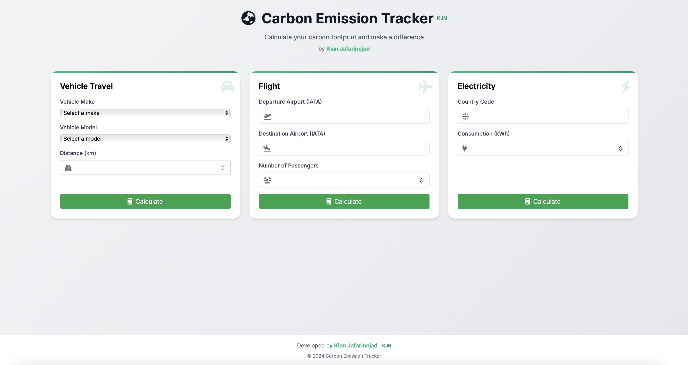
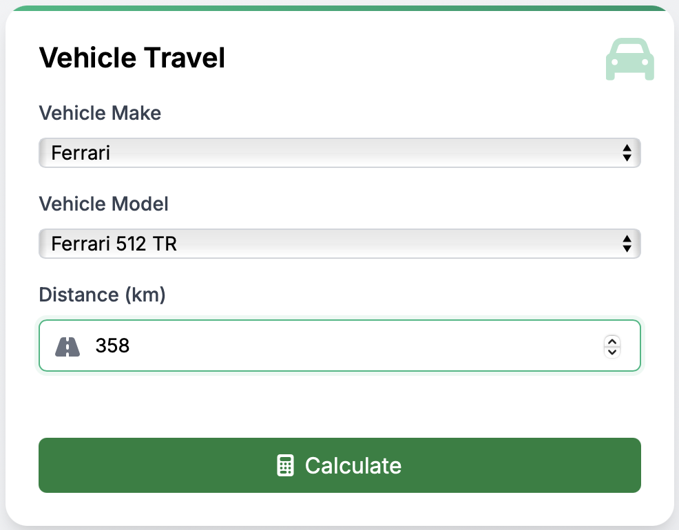
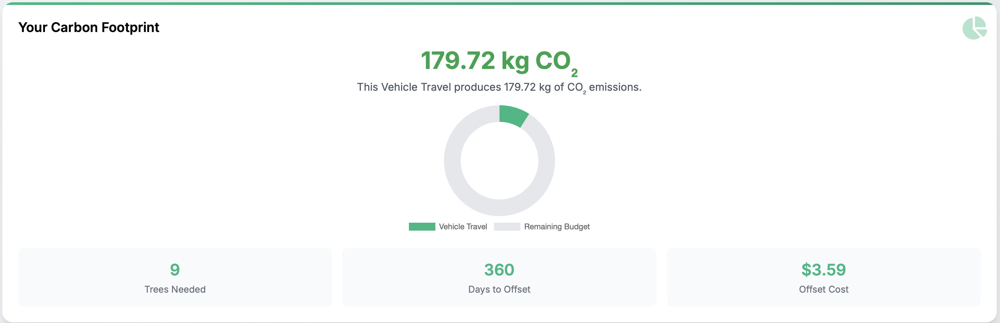

# Carbon Emission Tracker

A modern web application for calculating and tracking carbon emissions from various sources including vehicle travel, flights, and electricity consumption.

## Screenshots

### Main Interface

*Modern, card-based layout with intuitive navigation*

### Emission Calculators

*Vehicle, flight, and electricity emission calculators with real-time validation*

### Results Visualization

*Interactive charts and comprehensive emission statistics*

## Features

### Carbon Emission Calculations
- **Vehicle Travel**: Calculate emissions based on specific vehicle makes and models
- **Flight Travel**: Compute aviation emissions using departure and destination airports
- **Electricity Usage**: Estimate emissions from electricity consumption based on country-specific factors

### Enhanced User Interface
- Modern, responsive design with intuitive card-based layout
- Real-time data visualization using interactive charts
- Smooth animations and transitions for better user experience
- Informative icons and visual indicators
- Additional statistics including:
  - Number of trees needed for offset
  - Days required to offset emissions
  - Estimated offset cost

### Technical Features
- Real-time emission calculations
- Vehicle make and model data caching
- Comprehensive error handling
- Responsive design for all devices
- Interactive data visualization
- Form validation with user feedback

## Installation

1. Clone the repository:
```bash
git clone https://github.com/yourusername/carbon-emission-tracker.git
cd carbon-emission-tracker
```

2. Install dependencies:
```bash
pip install -r requirements.txt
```

3. Run the application:
```bash
python src/web/app.py
```

4. Open your browser and navigate to `http://localhost:5000`

## Usage

### Vehicle Emissions
1. Select your vehicle make from the dropdown
2. Choose the specific model
3. Enter the distance traveled in kilometers
4. Click "Calculate" to see your emissions impact

### Flight Emissions
1. Enter departure airport code (IATA)
2. Enter destination airport code (IATA)
3. Specify number of passengers
4. Click "Calculate" to view results

### Electricity Emissions
1. Enter your country code
2. Input electricity consumption in kWh
3. Click "Calculate" to see emissions

## Results and Visualization
- View your carbon footprint in kilograms of CO2
- Interactive doughnut chart showing emission breakdown
- Additional impact metrics:
  - Trees required for carbon offset
  - Time needed for natural offset
  - Estimated carbon offset cost

## Technology Stack
- Frontend: HTML5, CSS3 (Tailwind CSS), JavaScript
- Backend: Python, Flask
- Charts: Chart.js
- Icons: Font Awesome
- Animations: CSS3 Transitions

## Contributing
Contributions are welcome! Please feel free to submit a Pull Request.

## License
This project is licensed under the MIT License - see the LICENSE file for details.

## Author
Kian Jafarinejad (KJN)

## Acknowledgments
- Tailwind CSS for the UI framework
- Chart.js for data visualization
- Font Awesome for icons
- All contributors who have helped improve this project
